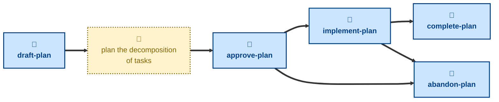

# Agent skills

The following skills are available to support the management of delivery
plans via AI agents.

- **[draft-plan](./draft-plan/):** \
  Scaffolds a PR for a new delivery plan.
  Cuts a `plan/<slug>` branch from `main`, prepares a fresh plan from the
  template, and opens a pull request in a draft state.
  Sets the status to `DRAFT`.

- **[approve-plan](./approve-plan/):** \
  Handles the `DRAFT` → `PLANNED` transition.
  Checks the breakdown and dependency graph are complete and takes the pull
  request out of draft, ready for review.

- **[implement-plan](./implement-plan/):** \
  Handles the `PLANNED` → `IN_PROGRESS` transition.
  Marks the plan as underway once implementation has started.

- **[complete-plan](./complete-plan/):** \
  Handles the `IN_PROGRESS` → `DONE` transition.
  Checks every task has shipped and merges the plan into the `main` trunk.

- **[abandon-plan](./abandon-plan/):** \
  Handles the `PLANNED`/`IN_PROGRESS` → `ABANDONED` transition.
  Drops the plan before completion and merges it as a permanent record of
  the decision.

## Workflow

The agent skills in this project are focused on the mechanics of managing the
lifecycle of delivery plans.
For help with the planning work itself — decomposing a project into small,
independently shippable increments — you may instruct agents to use the
[**plan**](https://github.com/kieranpotts/skills/tree/latest/dev/skills/plan)
skill in my global skills collection.

## Compatibility

These skills are compatible with the [Agent Skills](https://agentskills.io/)
convention. Most agent harnesses support this convention natively, but
workarounds may be required for harnesses that do not.
