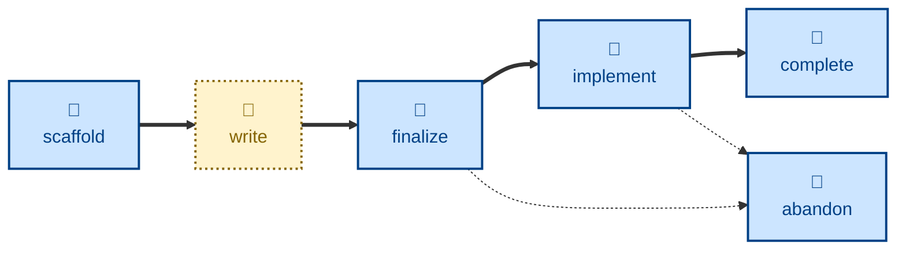

# Agent skills for managing delivery plans

The skills available to agents in this project are:

- **[scaffold-plan](./scaffold-plan/):** \
  Scaffolds a new delivery plan, ready for the user to work on.
  Sets the status to `DRAFT`.

- **[finalize-plan](./finalize-plan/):** \
  Handles the `DRAFT` → `PLANNED` transition.

- **[implement-plan](./implement-plan/):** \
  Handles the `PLANNED` → `IN PROGRESS` transition.

- **[complete-plan](./complete-plan/):** \
  Handles the `IN PROGRESS` → `DONE` transition.

- **[abandon-plan](./abandon-plan/):** \
  Handles the `PLANNED`/`IN PROGRESS` → `ABANDONED` transition.

The **scaffold-plan** skill .......

## Compatibility

These skills are compatible with the [Agent Skills](https://agentskills.io/)
convention. Most agent harnesses support this convention natively, but
workarounds may be required for harnesses that do not.
