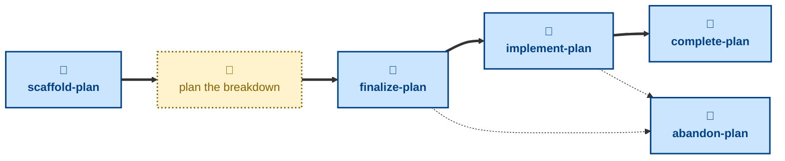

# Agent skills for managing delivery plans

The skills available to agents in this project are:

- **[scaffold-plan](./scaffold-plan/):** \
  Cuts a `plan/<slug>` branch from `main`, prepares a fresh plan from the
  template, and opens a pull request in a draft state.

- **[finalize-plan](./finalize-plan/):** \
  Checks the breakdown and dependency graph are complete and takes the pull
  request out of draft, ready for review.

- **[implement-plan](./implement-plan/):** \
  Marks the plan underway once implementation has started.

- **[complete-plan](./complete-plan/):** \
  Checks every task has shipped and merges the plan into the `main` trunk.

- **[abandon-plan](./abandon-plan/):** \
  Drops the plan before completion and merges it as a permanent record of
  the decision.

The **scaffold-plan** skill opens a new delivery plan as a draft PR, ready
for the user to break down. After this step, **finalize-plan** marks the
breakdown ready for review, and **implement-plan** marks it underway once
work has started. When every task has shipped, **complete-plan** lands the
plan in the `main` trunk. A plan may instead be dropped before completion
with **abandon-plan**, which is also merged as a permanent record.

These skills handle process, not substance: how a delivery plan is scaffolded,
tracked, and landed in `main`. For the planning work itself — decomposing the
work into small, independently shippable increments — use the
[**plan**](https://github.com/kieranpotts/skills/tree/latest/dev/skills/plan)
skill in my global skills collection.

## Compatibility

These skills are compatible with the [Agent Skills](https://agentskills.io/)
convention. Most agent harnesses support this convention natively, but
workarounds may be required for harnesses that do not.
