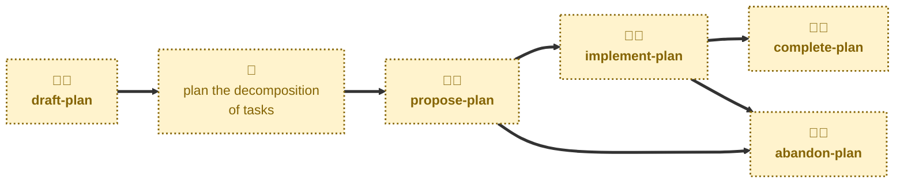

# Agent skills

The following skills are available to support the management of delivery
plans via AI agents.

- **[draft-plan](./draft-plan/):** \
  Scaffolds a PR for a new delivery plan.
  Cuts a `plan/<slug>` branch from `main`, prepares a fresh plan from the
  template, opens a pull request in a draft state, and opens its discussion
  thread. Sets the status to `DRAFT`. Leaves the task breakdown to a human.

- **[propose-plan](./propose-plan/):** \
  Handles the `DRAFT` → `PLANNED` transition.
  Checks the breakdown and dependency graph are complete and takes the pull
  request out of draft, ready for review.

- **[implement-plan](./implement-plan/):** \
  Handles the `PLANNED` → `IN PROGRESS` transition.
  Marks the plan as underway once implementation has started. It does not
  carry out the work, which is delivered task by task in the code
  repositories.

- **[complete-plan](./complete-plan/):** \
  Handles the `IN PROGRESS` → `DONE` transition.
  Checks every task has shipped, merges the plan into the `main` trunk,
  closes the discussion thread, and records the plan in the index.

- **[abandon-plan](./abandon-plan/):** \
  Handles the `PLANNED`/`IN PROGRESS` → `ABANDONED` transition.
  Records why the plan was dropped and merges it as a permanent record of
  the decision.

All five skills are interactive: each may prompt for its target plan, and the
two terminal skills always ask for explicit confirmation before merging.

## Workflow

The agent skills in this project are focused on the mechanics of managing the
lifecycle of delivery plans.
For help with the planning work itself — decomposing a project into small,
independently shippable increments — you may instruct agents to use the
[**plan**](https://github.com/kieranpotts/skills/tree/latest/dev/skills/plan)
skill in my global skills collection.

## Compatibility

These skills are compatible with the [Agent Skills](https://agentskills.io/)
convention. Most agent harnesses support this convention natively, but
workarounds may be required for harnesses that do not.
