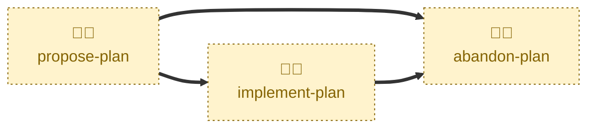

# Abandon plan

Handles the `PLANNED` / `IN PROGRESS` → `ABANDONED` transition.

Records why the plan was dropped, sets its status to `ABANDONED`,
squash-merges the pull request into `main`, closes the discussion thread, and
appends the plan to the plan index.

An abandoned plan is preserved permanently, exactly like a completed one. The
record of a decision not to build something is worth as much as the record of
one to build it — which is why the skill will not merge until the reason is
written into the document.

This is one of the two terminal transitions. The other is
[complete-plan](../complete-plan/), and the two behave identically apart from
the status they record and the gate they apply.

## Interactivity

Interactive. When run from `main` rather than a plan branch, the agent lists
the open plan pull requests and asks which plan to drop. It may also prompt
for the reason, and always asks for explicit confirmation before merging, so
it cannot be run unattended.

## How to invoke

> Abandon plan

> Drop the plan

> Cancel the plan

> We're not doing this

Run it on a `plan/<slug>` branch, or from `main` to pick from the open plan
pull requests.

## Recommended models

A mid-tier model is sufficient for this skill. The steps are procedural, but
holding the gate in front of them — refusing to merge a plan that does not
explain why it was dropped — takes a little more effort.

## Suggested workflows

Run this once the decision to drop the work is settled. A merely stalled plan
should be left where it is; abandonment is permanent and cannot be reversed
through the lifecycle.

## Related skills

- [**propose-plan**](../propose-plan/) \
  Moves the plan into `PLANNED`, one of the two states this skill accepts as
  input.

- [**implement-plan**](../implement-plan/) \
  Moves the plan into `IN PROGRESS`, the other state this skill accepts.

- [**complete-plan**](../complete-plan/) \
  The other terminal transition, for a plan whose every task shipped.

- [**draft-plan**](../draft-plan/) \
  Opens the plan. A plan still in `DRAFT` is not abandoned; its pull request
  is simply closed.

## References

- [CONTRIBUTING.md](../../../CONTRIBUTING.md) \
  The workflow and lifecycle rules this skill automates.
