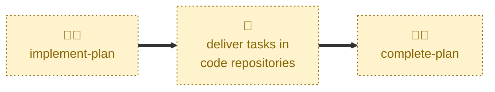

# Complete plan

Handles the `IN PROGRESS` → `DONE` transition.

Checks every task has shipped, sets the plan's status to `DONE`, squash-merges
the pull request into `latest/main`, closes the discussion thread, and appends
the plan to the plan index.

This is one of the two terminal transitions. The other is
[abandon-plan](../abandon-plan/), and the two behave identically apart from
the status they record and the gate they apply.

## Interactivity

Interactive. When run from `latest/main` rather than a plan branch, the agent
lists the `#in-progress` pull requests and asks which plan to complete. It also
always asks for explicit confirmation before merging, so it cannot be run
unattended.

## How to invoke

> Complete plan

> The plan is done

> All tasks shipped

> Finish the plan

Run it on a `latest/plan/<slug>` branch, or from `latest/main` to pick from the
`#in-progress` pull requests.

## Recommended models

A mid-tier model is sufficient for this skill. The steps are procedural, but
verifying that every task actually shipped — by following each tracker link
rather than trusting the document — takes a little more effort.

## Suggested workflows

Run this only once every task's tracker item is closed or merged. A plan is
not merged into `latest/main` until it is decided, so there is no intermediate
landing step to run first.

## Related skills

- [**implement-plan**](../implement-plan/) \
  Moves the plan into `IN PROGRESS`, the only state this skill accepts as
  input.

- [**abandon-plan**](../abandon-plan/) \
  The other terminal transition, for a plan dropped before every task
  shipped.

## References

- [CONTRIBUTING.md](../../../CONTRIBUTING.md) \
  The workflow and lifecycle rules this skill automates.
