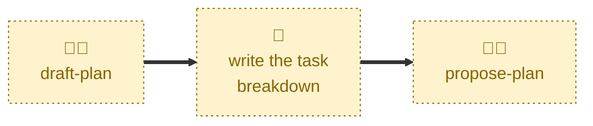

# Draft plan

Scaffolds a pull request for a new delivery plan.

Cuts a `latest/plan/<slug>` branch from `latest/main`, prepares a fresh plan
from the template, opens a pull request in a draft state, and opens the
discussion thread that will collect review feedback.

Sets the status to `DRAFT`. It does not decompose the work into tasks — the
task breakdown and dependency graph are left as template placeholders for a
human to write.

## Interactivity

Interactive. The agent may prompt for the goal, scope, and target
repositories of the work, and may ask the user to confirm the slug it derives
from them. It is therefore not suitable for unattended runs.

## How to invoke

> Draft plan

> Draft checkout hardening.

> New plan

> Start a plan

> Plan this

## Recommended models

A mid-tier model with strong prose output is best suited to this skill. The
scaffolding is mechanical, but capturing the shape of the work in the summary
and metadata requires a little more effort.

## Suggested workflows

Run this first, at the point a body of work is known to span more than one
task. Then write the task breakdown and dependency graph by hand before
marking the plan ready for review.

## Related skills

- [**propose-plan**](../propose-plan/) \
  Takes the draft pull request this skill opened out of draft, once the task
  breakdown is complete.

- [**abandon-plan**](../abandon-plan/) \
  Drops a plan that was drafted and agreed but is no longer wanted. A plan
  still in `DRAFT` is not abandoned; its pull request is simply closed.

## References

- [CONTRIBUTING.md](../../../CONTRIBUTING.md) \
  The workflow and lifecycle rules this skill automates.
