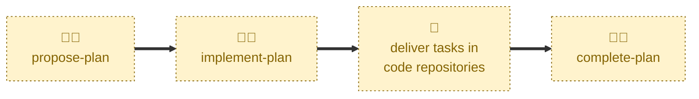

# Implement plan

Handles the `PLANNED` → `IN PROGRESS` transition.

Marks the plan as underway once implementation has started, swapping the
`#planned` label on the pull request for `#in-progress`.

The name is about the plan's state, not about doing the work. This skill
edits the plan document and its pull request only. The tasks themselves are
delivered through their linked trackers in the target code repositories, and
this skill never touches those.

## Interactivity

Interactive. When run from `main` rather than a plan branch, the agent lists
the `#planned` pull requests and asks which plan to start. Run it on the
plan's own branch to avoid the prompt.

## How to invoke

> Implement plan

> Start this plan

> Work has begun

> The plan is underway

> Move the plan to in progress

Run it on a `plan/<slug>` branch, or from `main` to pick from the `#planned`
pull requests.

## Recommended models

A fast, cheap model is sufficient for this skill. It is a mechanical state
transition behind a simple gate.

## Suggested workflows

Run this at the point the first task actually starts moving in its tracker —
not when the breakdown is merely agreed, which is what `PLANNED` already
records.

## Related skills

- [**propose-plan**](../propose-plan/) \
  Moves the plan into `PLANNED`, the only state this skill accepts as input.

- [**complete-plan**](../complete-plan/) \
  Settles the plan as `DONE` once every task it tracks has shipped.

- [**abandon-plan**](../abandon-plan/) \
  The other exit from `IN PROGRESS`, for work dropped part-way through.

## References

- [CONTRIBUTING.md](../../../CONTRIBUTING.md) \
  The workflow and lifecycle rules this skill automates.
