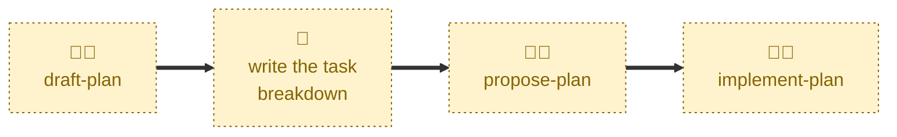

# Propose plan

Handles the `DRAFT` → `PLANNED` transition.

Checks the task breakdown and dependency graph are complete, then takes the
pull request out of draft and labels it `#planned`, ready for review.

The completeness check is a gate, not a repair job: where the breakdown is
incomplete, the skill reports what is missing and stops rather than filling
the gaps itself.

## Interactivity

Interactive. When run from `main` rather than a plan branch, the agent lists
the open draft pull requests and asks which plan to propose. Run it on the
plan's own branch to avoid the prompt.

## How to invoke

> Propose plan

> This plan is ready

> Mark the plan ready

> The breakdown is done

> Take the plan out of draft

Run it on a `plan/<slug>` branch, or from `main` to pick from the open draft
pull requests.

## Recommended models

A mid-tier model is sufficient for this skill. It applies a readiness gate to
a concrete case — bounded judgment, not deep reasoning.

## Suggested workflows

Run this once the task breakdown is written and agreed. Do not run it on
every push to a plan branch: a plan is meant to sit in draft while the
decomposition is refined.

## Related skills

- [**draft-plan**](../draft-plan/) \
  Opens the draft pull request that this skill takes out of draft.

- [**implement-plan**](../implement-plan/) \
  Picks the plan up from `PLANNED` once work actually starts.

- [**abandon-plan**](../abandon-plan/) \
  The other exit from `PLANNED`, for a plan agreed but never started.

## References

- [CONTRIBUTING.md](../../../CONTRIBUTING.md) \
  The workflow and lifecycle rules this skill automates.
