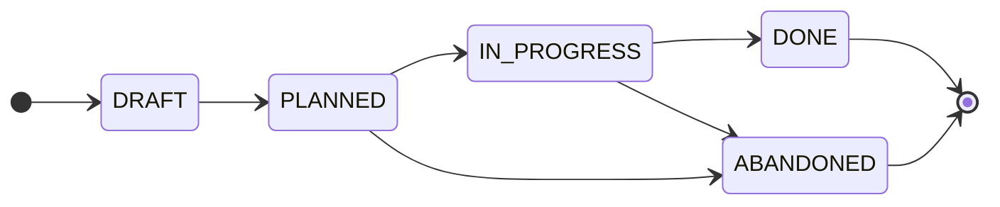

# Contributing

<!-- Agents MUST read ./AGENTS.md. This document is for humans. -->

These contributing guidelines provide step-by-step instructions for planning the
implementation of changes to the system.

The focus here is on the mechanics and guardrails of the planning process. See
the [documentation](./docs/) for more general guidance on how to get the most
out of it.

Delivery plans are produced and maintained by the technical teams. Anyone with
write access to this repository may draft a plan.

****
The capitalized words REQUIRED, MUST, MUST NOT, RECOMMENDED, SHOULD,
SHOULD NOT, OPTIONAL, and MAY herein are to be interpreted as described
in [IETF RFC 2119](https://www.ietf.org/rfc/rfc2119.txt).
****

## Lifecycle

Each plan moves through a defined state machine. The current state is shown in
the plan document's `Status` field. . In addition, to make it easier to search
and filter new plans, corresponding labels are applied to open pull requests:
`#planned`, `#in-progress`, etc.

The states are:

- `DRAFT`: The plan is being written.

- `PLANNED`: The decomposition is complete and open for review. Work has not yet
  started.

- `IN PROGRESS`: Implementation is underway. Tasks are being delivered through
  their linked trackers in the code repositories.

- `DONE`: Every task has shipped.

- `ABANDONED`: The plan is dropped before completion.

### Allowed state transitions

The permitted state transitions are intended to be simple, memorable, and easy
to enforce through automation and agentic workflows.



| From          | To            | Condition                            |
| ------------- | ------------- | ------------------------------------ |
| _(new)_       | `DRAFT`       | Initial scaffolding.                 |
| `DRAFT`       | `PLANNED`     | Decomposition complete.              |
| `PLANNED`     | `IN PROGRESS` | Implementation started.              |
| `IN PROGRESS` | `DONE`        | Implementation complete.             |
| `PLANNED`     | `ABANDONED`   | Dropped before implementation began. |
| `IN PROGRESS` | `ABANDONED`   | Dropped before work completed.       |

Transitions not listed are not permitted. A plan MUST NOT move backwards
and MUST NOT skip states.

## Workflow

> [!TIP]
> [Agent skills](./.agents/skills/) are available to help automate some steps in
> this workflow. It is RECOMMENDED to use agents to drive state transitions.
> Doing so helps to maintain consistency.

A pull request is the vehicle for a plan. Open it as soon as you are ready to
start writing.

1.  Branch off `main` as `plan/<slug>`.

2.  Copy [`plans/TEMPLATE.md`](./plans/TEMPLATE.md) to `plans/<slug>/README.md`.
    The plan lives in its own directory, so you may add supporting artifacts –
    sequence diagrams, data, mock-ups – alongside the `README.md`. Fill in the
    metadata header and write the `Summary`, `Scope`, and `Approach`.

3.  Build the `Task breakdown`. Each row is one task: a stable ID, a short
    imperative title, the target repository, the link to its concrete tracker
    item, and its dependencies. Then draw the `Dependency graph` from the
    `Depends on` column.

4.  Commit and open the pull request as a draft, titled `plan: <description>`,
    where `<description>` is a short prose title written full lowercase.

5.  Open an associated [discussion
    thread](https://github.com/kieranpotts/plans/discussions) for the plan, and
    link it from the plan document's `Discussion thread` field and from the pull
    request. All feedback belongs in the discussion, not on the pull request –
    this keeps the PR focused on the evolution of the plan document. The thread
    stays open for the life of the plan, and is closed when the PR is merged.

6.  Keep the pull request in draft while you refine the breakdown. When it is
    complete and agreed, mark the PR ready for review and apply the `#planned`
    label.

7.  When work starts, move the plan to `#in-progress`. The discussion thread
    stays open – feedback may continue as the plan evolves. Deliver each task
    through its linked tracker in the relevant code repository. As reality
    unfolds, keep the breakdown and dependency graph current – add, drop, or
    re-sequence tasks – but never repurpose a task ID.

8.  When every task has shipped, mark the plan `DONE`, squash-merge it to `main`
    (which closes the discussion thread), and append it to
    [`plans/INDEX.md`](./plans/INDEX.md). If the plan is dropped, mark it
    `ABANDONED` and do the same – the record is preserved either way.

## Rules

- MUST write in American English.

- The `main` trunk is the default branch.

- Each plan is a single, coherent body of work, developed on a `plan/<slug>`
  branch cut from `main`, with a pull request titled `plan: <description>`. The
  `<description>` is a short prose title, not the hyphenated branch slug. The
  slug is used only for the branch name and the plan directory
  (`plans/<slug>/`).

- The plan document MUST NOT track the live status of individual tasks. Status
  lives in each task's linked code repository tracker.

- Each task MUST name exactly one target repository and link to its concrete
  issue or pull request there.

- Task IDs are stable and assigned in creation order, not execution order.
  Re-sequencing changes the `Depends on` column and the dependency graph, never
  the IDs.

- The `Dependency graph` MUST stay in sync with the `Depends on` column.

- Upstream linkage is loose and reference-only, via the `References` section.

- A plan PR carries exactly one lifecycle label – `#planned`, `#in-progress`,
  `#done`, or `#abandoned`. The PR is opened initially as a draft.

- Every plan PR MUST have an associated discussion thread, opened with the PR
  and used for all feedback. The thread stays open for the life of the plan, and
  is closed when the PR is merged.

- A plan MUST NOT be merged into `main` until it is decided – done or abandoned.

- Plan branches MUST be squash-merged to `main`, with the squash commit message
  `plan: <description> - DONE|ABANDONED`.

- After merge, the plan is appended to [`plans/INDEX.md`](./plans/INDEX.md) in
  implementation order, in a direct-to-`main` commit. The plan directory is
  never renamed; the slug is its identity. No numeric ID is assigned.

- Never delete a plan document, including abandoned ones.

## Tools

### Pre-commit hooks

It is RECOMMENDED to install the [pre-commit](https://pre-commit.com) framework
to enable local validation hooks before committing. You need only to run the
following command once to install pre-commit system-wide:

```bash
pipx install pre-commit
```

Then install the pre-commit hooks in every local repository where you want
pre-commit checks to be run:

```bash
pre-commit install
```

This installs all hook types declared in `.pre-commit-config.yaml`
(`pre-commit`, `commit-msg`).

Edit `./.pre-commit-config.yaml` to configure the pre-commit validation checks
you want for your project. See the [pre-commit](https://pre-commit.com) docs for
details.

## Contributor license agreement

<!-- Delete this for closed source projects. -->

By opening a pull request to this repository, you accept and agree to the
following terms and conditions:

- You agree that your contribution may be distributed under the terms of the
  [CC0 1.0 Universal license](./LICENSE.txt), effectively releasing it to the
  public domain.

- You certify that your contribution is either created in whole by you and you
  have the right to distribute it under the designated license, or is based on a
  previous work with a compatible license that permits distribution and
  modification under the designated license.

- You understand and agree that your contribution is public and that a record of
  it, including all personal information you submit with it, is maintained
  indefinitely and may be redistributed consistent with the designated license.
