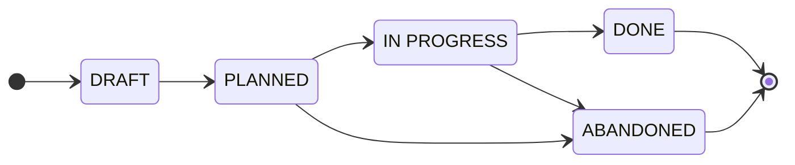
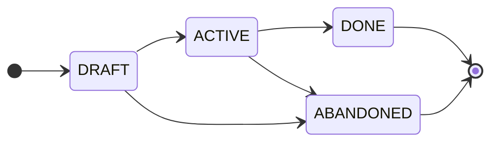

# Contributing

<!-- Agents MUST read ./AGENTS.md. This document is for humans. -->

These contributing guidelines provide step-by-step instructions for planning the
implementation of changes to the system.

The focus here is on the mechanics and guardrails of the planning process. See
the [documentation](./docs/) for more general guidance on how to get the most
out of it.

Delivery plans are produced and maintained by the technical teams. Anyone with
write access to this repository may draft a plan.

****
The capitalized words REQUIRED, MUST, MUST NOT, RECOMMENDED, SHOULD,
SHOULD NOT, OPTIONAL, and MAY herein are to be interpreted as described
in [IETF RFC 2119](https://www.ietf.org/rfc/rfc2119.txt).
****

## Lifecycle

Each plan moves through a defined state machine. The current state is shown in
the plan document's `Status` field. In addition, to make it easier to search
and filter new plans, corresponding labels are applied to open pull requests:
`#planned`, `#in-progress`, etc.

The states are:

- `DRAFT`: The plan is being written.

- `PLANNED`: The decomposition is complete and open for review. Work has not yet
  started.

- `IN PROGRESS`: Implementation is underway. Tasks are being delivered through
  their linked trackers in the code repositories.

- `DONE`: Every task has shipped.

- `ABANDONED`: The plan is dropped before completion.

The following state transitions are permitted. They are intended to be simple,
memorable, and easy to enforce through automation and agentic workflows.



| From          | To            | Condition                            |
| ------------- | ------------- | ------------------------------------ |
| _(new)_       | `DRAFT`       | Initial scaffolding.                 |
| `DRAFT`       | `PLANNED`     | Decomposition complete.              |
| `PLANNED`     | `IN PROGRESS` | Implementation started.              |
| `IN PROGRESS` | `DONE`        | Implementation complete.             |
| `PLANNED`     | `ABANDONED`   | Dropped before implementation began. |
| `IN PROGRESS` | `ABANDONED`   | Dropped before work completed.       |

Transitions not listed are not permitted. A plan MUST NOT move backwards
and MUST NOT skip states.

## Milestones and roadmap

A milestone is a named grouping of one or more plans under a shared goal. Scope,
breakdown, and delivery status all continue to live on the member plans. A
milestone only answers "which plans belong together, and roughly when do they
land."

Milestones share the plan state machine, minus the intermediate states a
grouping doesn't need.



| From      | To          | Condition                                       |
| --------- | ----------- | ----------------------------------------------- |
| _(new)_   | `DRAFT`     | Initial scaffolding, member plans may be TBD.   |
| `DRAFT`   | `ACTIVE`    | At least one member plan is `PLANNED` or later. |
| `ACTIVE`  | `DONE`      | Every member plan is `DONE`.                    |
| `DRAFT`   | `ABANDONED` | Dropped before any member plan started.         |
| `ACTIVE`  | `ABANDONED` | Dropped before every member plan completed.     |

The [roadmap](./roadmap/INDEX.md) is the ordered, living view of every
`DRAFT` and `ACTIVE` milestone, grouped into `Now` / `Next` / `Later`. It is
a single file, edited in place. Milestones can be reordered and re-prioritized
here, without touching the milestone documents themselves.

1.  Copy the [milestone template](./milestones/TEMPLATE.md) to
    `milestones/<slug>.md`. Fill in the metadata header and the `Goal`.
    Link any plans that already exist under `Plans`. Add more as they
    are drafted.

2.  Add a row for the milestone to `roadmap/INDEX.md`, in whichever bucket
    reflects current thinking.

3.  As member plans move through their own lifecycle, keep the milestone's
    `Plans` list current. Move the milestone between buckets, or
    reorder it within a bucket, as priorities shift. This is expected to
    happen often and needs no review ceremony beyond the normal PR flow.

4.  When every member plan reaches `DONE`, mark the milestone `DONE`. If the
    milestone is dropped before that, mark it `ABANDONED`. Either way, remove
    its row from `roadmap/INDEX.md` and append it to `milestones/INDEX.md`.

## Workflow

> [!TIP]
> [Agent skills](./.agents/skills/) are available to help automate some steps in
> this workflow. It is RECOMMENDED to use agents to drive state transitions.
> Doing so helps to maintain consistency.

1.  Branch off `main` as `plan/<slug>`.

2.  Copy the [template](./plans/TEMPLATE.md) to `plans/<slug>/README.md`.
    The plan lives in its own directory, so you may add supporting artifacts –
    sequence diagrams, data, mock-ups – alongside the `README.md`. Fill in the
    metadata header and write the `Summary`, `Scope`, and `Approach`.

3.  Build the `Task breakdown`. Each row is one task: a stable ID, a short
    imperative title, the target repository, the link to its concrete tracker
    item, and its dependencies. Then draw the `Dependency graph` from the
    `Depends on` column.

4.  Commit and open the pull request as a draft, titled `create: <description>`,
    where `<description>` is a short prose title written full lowercase.

5.  Open a [discussion thread](https://github.com/kieranpotts/plans/discussions),
    filed under the `Plans` discussion category, and link it from the plan
    doc's `Discussion thread` field, and from the pull request description.

6.  Keep the pull request in draft while you refine the breakdown. When it is
    complete and agreed, mark the PR ready for review and apply the `#planned`
    label.

7.  When work starts, move the plan to `#in-progress`. Deliver each task
    through its linked tracker in the relevant code repository. As reality
    unfolds, keep the breakdown and dependency graph current – add, drop, or
    re-sequence tasks.

8.  When every task has shipped, mark the plan `DONE`, squash-merge it to `main`,
    and append it to the [plans index](./plans/INDEX.md). If the plan is
    dropped, mark it `ABANDONED` and do the same.

## Rules

- All artifacts MUST be written in American English.

- The `main` trunk MUST be treated as the default branch.

- The plan document MUST NOT track the live status of individual tasks. Status
  lives in each task's linked code repository tracker.

- Each task MUST name exactly one target repository and link to its concrete
  issue or pull request there.

- Task IDs MUST be stable, assigned in creation order, not execution order.
  Re-sequencing changes the `Depends on` column and the dependency graph, never
  the IDs.

- The `Dependency graph` MUST stay in sync with the `Depends on` column.

- Upstream linkage SHOULD be loose and reference-only, via the `References`
  section.

- A plan MUST NOT be merged into `main` until it is decided – done or abandoned.

- Plan branches MUST be squash-merged to `main`, with the squash commit message
  `update: <description> - DONE|ABANDONED`.

- The discussion thread MUST be closed when the PR is merged.

- The plan directory MUST NOT be renamed; the slug is its identity. No numeric
  ID is assigned.

- A plan document MUST NOT be deleted, including abandoned ones.

- A milestone document MUST NOT define scope directly. Scope lives on its
  member plans.

- A milestone's member `Plans` list MUST reference existing plans by relative
  link into `plans/<slug>/`.

- `roadmap/INDEX.md` MUST list only `DRAFT` or `ACTIVE` milestones. A milestone
  MUST be removed from `roadmap/INDEX.md` in the same change that marks it
  `DONE` or `ABANDONED`.

- `roadmap/INDEX.md` MUST NOT carry fixed dates. Sequencing is expressed only via
  the `Now` / `Next` / `Later` buckets and order within a bucket.

- A milestone document MUST NOT be deleted, including abandoned ones.

## Tools

### Pre-commit hooks

It is RECOMMENDED to install the [pre-commit](https://pre-commit.com) framework
to enable local validation hooks before committing. You need only to run the
following command once to install pre-commit system-wide:

```bash
pipx install pre-commit
```

Then install the pre-commit hooks in every local repository where you want
pre-commit checks to be run:

```bash
pre-commit install
```

This installs all hook types declared in `.pre-commit-config.yaml`
(`pre-commit`, `commit-msg`).

Edit `./.pre-commit-config.yaml` to configure the pre-commit validation checks
you want for your project. See the [pre-commit](https://pre-commit.com) docs for
details.

## Contributor license agreement

<!-- Delete this for closed source projects. -->

By opening a pull request to this repository, you accept and agree to the
following terms and conditions:

- You agree that your contribution may be distributed under the terms of the
  [CC0 1.0 Universal license](./LICENSE.txt), effectively releasing it to the
  public domain.

- You certify that your contribution is either created in whole by you and you
  have the right to distribute it under the designated license, or is based on a
  previous work with a compatible license that permits distribution and
  modification under the designated license.

- You understand and agree that your contribution is public and that a record of
  it, including all personal information you submit with it, is maintained
  indefinitely and may be redistributed consistent with the designated license.
