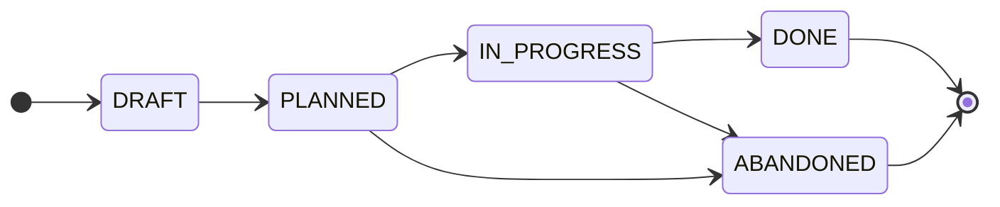

# Contributing

<!-- Agents MUST read ./AGENTS.md. This document is for humans. -->

These contributing guidelines provide step-by-step instructions for planning the implementation of changes to the system. The focus here is on the mechanics and guardrails of the planning process. See the [documentation](./docs/) for more general guidance on how to get the most out of it.

Implementation plans are produced and maintained by the technical teams. Anyone with write access to this repository may draft a plan.

> [!NOTE]
> The capitalized words REQUIRED, MUST, MUST NOT, RECOMMENDED, SHOULD, SHOULD NOT, OPTIONAL, and MAY herein are to be interpreted as described in [IETF RFC 2119](https://www.ietf.org/rfc/rfc2119.txt).

## The unit of planning

The unit of planning is an initiative: a self-contained body of work with a goal, a scope, and a decomposition into tasks. An initiative is its own planning unit. It draws on upstream artifacts — a requirement in the [SRS](https://github.com/kieranpotts/specs), a decision in the [RFC](https://github.com/kieranpotts/rfc) archive, a target in the [design docs](https://github.com/kieranpotts/design) — but it need not map one-to-one to any of them. Those upstream links are loose and reference-only.

Each task in an initiative lives in exactly one code repository and links out to a concrete issue or pull request there. That linked tracker owns the task's live status — this repository does not track it. What this repository contributes is the cross-repository decomposition and sequencing: the breakdown of the initiative into tasks, and the dependency graph that orders them across as many repositories as the initiative touches.

## The plan lifecycle

Each plan moves through a defined state machine. The current state is shown in the plan document's `Status` field, and mirrored by a label on its pull request.

- `DRAFT`: The plan is being written. Its pull request is open as a draft — not yet ready for review.

- `PLANNED`: The decomposition is complete and open for review. The pull request is marked ready for review and labeled `#planned`, and its discussion thread is where review feedback is gathered. Work has not yet started.

- `IN PROGRESS`: Review has concluded and implementation is underway. The discussion thread is closed. Tasks are being delivered through their linked trackers in the code repositories. The PR carries `#in-progress`. The plan document MAY continue to evolve — tasks added, dropped, or re-sequenced as reality unfolds.

- `DONE`: Every task has shipped. The plan is merged into `main` and appended to the [plans index](./plans/INDEX.md), in implementation order.

- `ABANDONED`: The initiative is dropped before completion. The plan is merged into `main` as a permanent record of the decision, and appended to the index.

Only the following transitions are allowed:

| From          | To            | Condition                            |
| ------------- | ------------- | ------------------------------------ |
| _(new)_       | `DRAFT`       | Initial scaffolding.                 |
| `DRAFT`       | `PLANNED`     | Decomposition complete.              |
| `PLANNED`     | `IN PROGRESS` | Implementation started.              |
| `IN PROGRESS` | `DONE`        | Implementation complete.             |
| `PLANNED`     | `ABANDONED`   | Dropped before implementation began. |
| `IN PROGRESS` | `ABANDONED`   | Dropped before work completed.       |

Transitions not listed are not permitted. A plan MUST NOT move backwards or skip states.

> [!TIP]
> This repository includes a suite of [agent skills](./.agents/skills/) that automate the state transitions and enforce the gate rules. It is RECOMMENDED to get AI agents to apply state transitions, by prompting the agents to use these skills, to keep the process consistent.

## Workflow

### Step 1: Open a pull request and a discussion thread

A pull request is the vehicle for a plan. Open it as soon as you are ready to start writing.

1. Branch off `main` as `plan/<slug>`.

2. Copy [`plans/TEMPLATE.md`](./plans/TEMPLATE.md) to `plans/<slug>/README.md`. The plan lives in its own directory, so you may add supporting artifacts — sequence diagrams, data, mock-ups — alongside the `README.md`. Fill in the metadata header and write the `Summary`, `Scope`, and `Approach`.

3. Build the `Task breakdown`. Each row is one task: a stable ID, a short imperative title, the target repository, the link to its concrete tracker item, and its dependencies. Then draw the `Dependency graph` from the `Depends on` column.

4. Commit and open the pull request as a draft, titled `plan: <description>`, where `<description>` is a short prose title written full lowercase.

5. Open an associated [discussion thread](https://github.com/kieranpotts/plans/discussions) for the plan, and link it from the plan document's `Discussion thread` field and from the pull request. All review feedback belongs in the discussion, not on the pull request — this keeps the PR focused on the evolution of the plan document. The thread stays open while the breakdown is reviewed, and is closed once implementation begins.

6. Keep the pull request in draft while you refine the breakdown. When it is complete and agreed, mark the PR ready for review and apply the `#planned` label.

### Step 2: Implement

When review has concluded and work starts, move the plan to `#in-progress` and close the discussion thread. Deliver each task through its linked tracker in the relevant code repository. As reality unfolds, keep the breakdown and dependency graph current — add, drop, or re-sequence tasks — but never repurpose a task ID.

### Step 3: Settle

When every task has shipped, mark the plan `DONE`, squash-merge it to `main`, and append it to [`plans/INDEX.md`](./plans/INDEX.md). If the initiative is dropped, mark it `ABANDONED` and do the same — the record is preserved either way.

## Rules

- MUST write in American English.

- The `main` trunk is the default branch.

- Each plan is a single initiative, developed on a `plan/<slug>` branch cut from `main`, with a pull request titled `plan: <description>`. The `<description>` is a short prose title, not the hyphenated branch slug. The slug is used only for the branch name and the plan directory (`plans/<slug>/`).

- The plan document MUST NOT track the live status of individual tasks. Status lives in each task's linked code repository tracker.

- Each task MUST name exactly one target repository and link to its concrete issue or pull request there.

- Task IDs are stable and assigned in creation order, not execution order. Re-sequencing changes the `Depends on` column and the dependency graph, never the IDs.

- The `Dependency graph` MUST stay in sync with the `Depends on` column.

- Upstream linkage is loose and reference-only, via the `References` section.

- A plan PR carries exactly one lifecycle label — `#planned`, `#in-progress`, `#done`, or `#abandoned`. The PR is opened initially as a draft.

- Every plan PR MUST have an associated discussion thread, opened with the PR and used for all review feedback. The thread is closed once implementation begins (`IN PROGRESS`).

- A plan MUST NOT be merged into `main` until the initiative is decided — done or abandoned.

- Plan branches MUST be squash-merged to `main`, with the squash commit message `plan: <description> - DONE|ABANDONED`.

- After merge, the plan is appended to [`plans/INDEX.md`](./plans/INDEX.md) in implementation order, in a direct-to-`main` commit. The plan directory is never renamed; the slug is its identity. No numeric ID is assigned.

- Never delete a plan document, including abandoned ones.

## Contributor license agreement

<!-- Delete this for closed source projects. -->

By opening a pull request to this repository, you accept and agree to the following terms and conditions:

- You agree that your contribution may be distributed under the terms of the [MIT license](./LICENSE.txt).

- You certify that your contribution is either created in whole by you and you have the right to distribute it under the designated license, or is based on a previous work with a compatible license that permits distribution and modification under the designated license.

- You understand and agree that your contribution is public and that a record of it, including all personal information you submit with it, is maintained indefinitely and may be redistributed consistent with the designated license.
