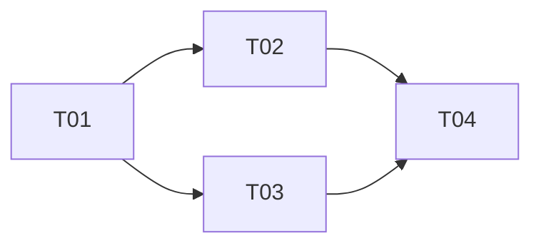

# Plan title, eg. "Checkout hardening"

- Authors: Your Name [@your-github-handle], ...
- Created: YYYY-MM-DD
- Last updated: YYYY-MM-DD
- Plan PR: #...
- Discussion thread:
- Target repositories: owner/repo, owner/repo, ...

## Status

DRAFT | PLANNED | IN PROGRESS | DONE | ABANDONED

## References

_Link out to upstream artifacts this plan implements. Cite by URL or index
number._

- Implements: SRS #NNNN, ...
- Informed by: RFC #NNNN, ...
- Targets design: <link to design doc / view>, ...
- Related plans: #... (in-flight) or NNNN (completed, by INDEX number)

## Summary

_A short, single-paragraph statement of what this plan delivers and why it is
being undertaken now. What does "done" look like?_

## Scope

_What is included in this plan, and — just as important — what is explicitly out
of scope. Name the boundaries so the breakdown below can be judged complete._

## Approach

_A short narrative of the implementation strategy: the order of attack, the
sequencing rationale, any phasing (eg. behind a feature flag, staged rollout),
and the key risks or unknowns that shape the plan. This is the prose that the
task tree below makes concrete._

## Task breakdown

_Decompose the plan into units of work ("tasks") that target exactly one code
repository. Link out to concrete issues and/or PRs – these track the live status
of each task's implementation. Keep `Depends on` accurate – it is what the
dependency graph, below, is built from._

| ID  | Task | Repo | Tracker | Depends on |
| --- | ---- | ---- | ------- | ---------- |
| T01 | Short imperative title | owner/repo | owner/repo#NN | —        |
| T02 | Short imperative title | owner/repo | owner/repo#NN | T01      |
| T03 | Short imperative title | owner/repo | owner/repo#NN | T01      |
| T04 | Short imperative title | owner/repo | owner/repo#NN | T02, T03 |

## Dependency graph

## Open questions

_Unresolved questions, decisions deferred, or items parked as out-of-scope that
will need a plan of their own later._
