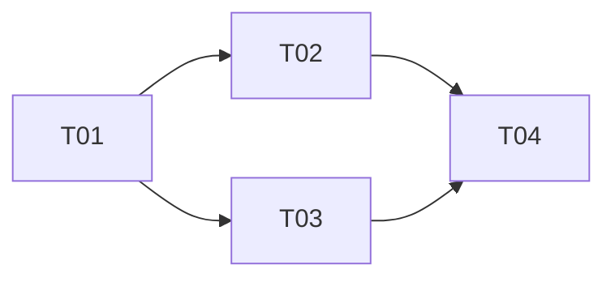

# Checkout hardening

> [!NOTE]
> This is a sample plan, included to illustrate the format. It describes a
> fictional system and does not reflect a real plan.

- Authors: Jane Doe [@janedoe]
- Created: 2026-01-12
- Last updated: 2026-02-20
- Plan PR: #41
- Discussion thread:
- Target repositories: acme/storefront-api, acme/storefront-web

## Status

DONE

## References

- Implements: SRS #204, #211
- Informed by: RFC #33
- Targets design: [Payments — Logical view](https://github.com/kieranpotts/design)
- Related plans: —

## Summary

Hardens the checkout flow against duplicate charges and stale cart state,
following two production incidents where a slow network retry led to a
customer being charged twice. Done means the checkout API rejects duplicate
submissions idempotently, and the web client surfaces a clear retry state
instead of silently resubmitting.

## Scope

In-scope: idempotency keys on the checkout API, client-side retry/backoff
handling, and cart-state revalidation immediately before charge. Out of
scope: the payment gateway integration itself, and any change to the
cart/pricing engine.

## Approach

Land the API idempotency-key support first, since the web client's retry
behavior depends on it. Roll out behind a feature flag to a 10% cohort
before enabling for all traffic, to catch regressions in checkout
completion rate.

## Task breakdown

| ID  | Task | Repo | Tracker | Depends on |
| --- | ---- | ---- | ------- | ---------- |
| T01 | Add idempotency-key support to checkout endpoint | acme/storefront-api | acme/storefront-api#512 | — |
| T02 | Revalidate cart state before charge | acme/storefront-api | acme/storefront-api#513 | T01 |
| T03 | Add retry/backoff with idempotency key to checkout client | acme/storefront-web | acme/storefront-web#298 | T01 |
| T04 | Roll out behind feature flag, monitor completion rate | acme/storefront-web | acme/storefront-web#301 | T02, T03 |

## Dependency graph

## Open questions

None outstanding at completion.
