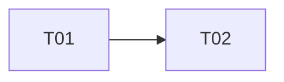

# Multi-currency catalog

> [!NOTE]
> This is a sample plan, included to illustrate the format. It describes a
> fictional system and does not reflect a real plan.

- Authors: John Smith [@johnsmith]
- Created: 2026-03-03
- Last updated: 2026-04-18
- Plan PR: #47
- Discussion thread:
- Target repositories: acme/storefront-api

## Status

ABANDONED

## References

- Implements: SRS #240
- Informed by: —
- Targets design: —
- Related plans: —

## Summary

Intended to let the product catalog store and serve prices in multiple
currencies natively, rather than converting from a single base currency at
request time. Abandoned before completion — see below.

## Scope

In scope: multi-currency price storage on the catalog service, and a
currency-aware pricing API. Out of scope: checkout and payment processing,
which would have consumed the new API in a later plan.

## Approach

Planned to migrate the price schema first, backfilling from the existing
base-currency prices, then expose the new currency-aware endpoints.

## Task breakdown

| ID  | Task | Repo | Tracker | Depends on |
| --- | ---- | ---- | ------- | ---------- |
| T01 | Migrate price schema to store per-currency amounts | acme/storefront-api | acme/storefront-api#560 | — |
| T02 | Backfill existing prices from base currency | acme/storefront-api | acme/storefront-api#561 | T01 |

## Dependency graph

## Open questions

Abandoned after T01: the schema migration revealed that the pricing data was
also consumed by a legacy reporting pipeline outside the scope of this plan's
target repositories, meaning the change could not be delivered safely without
a much larger, cross-team effort. Revisiting this is parked pending a
dedicated plan that includes the reporting pipeline in scope.
